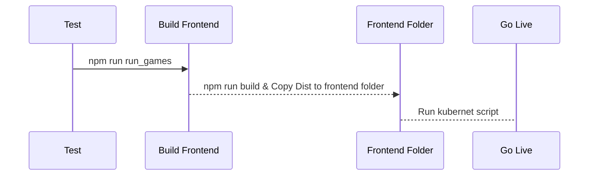

# Table of Contents
1. [Run Tests](#runtests)
2. [Launch Site & Backend](#sitebackend)
3. [Build Frontend](#buildfrontend)
4. [Start backend and Site](#startsidebackend)
5. [Deploy Procedure](#deploy)


## Run Tests

#### To get all the games for today
```javascript
npm run run_games
```
#### To get all games results for yesterday
```javascript
npm run run_results
```
## Launch Site & Backend

#### Backend and frontend are already merged together 
This will lauch the last version of site built
```javascript
npm run start
```

## Build Frontend

#### To build frontend we need to go to site (Cralwer_frontend) project and run : 
```javascript
npm run build
```
Then copy all the files from dist folder to the folder frontend in backend project

## Start backend and Site
```javascript
npm run start
```

By default it will run at port 3000 

## Deploy Procedure

Lets describe the process for deploy the site and backend  



 

 1. Make sure you've built the site
 2. Copy the last version of site to frontend folder
 3. Publish the backend to master branch (push git repo)
 4. Run command to build the last docker in a local server (in docker folder)
     ```javascript
     docker build --no-cache -t registry2.wallid.io/base/nodejs-dev-tools:v7 .
	```

 5. Then push that locally created docker to the registry online (wallid :) :) )   

  ```javascript
      docker push registry2.wallid.io/base/nodejs-dev-tools:v7
```

 6. Run deployment.yml file with new version of docker to deploy at kubernet cluster

 
   

